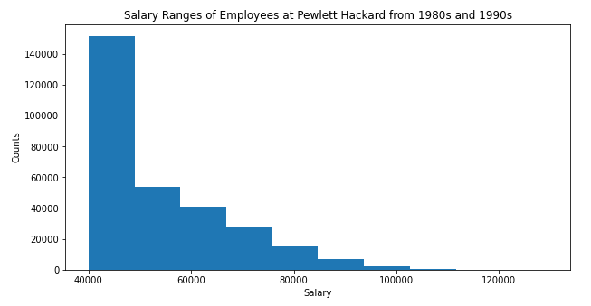
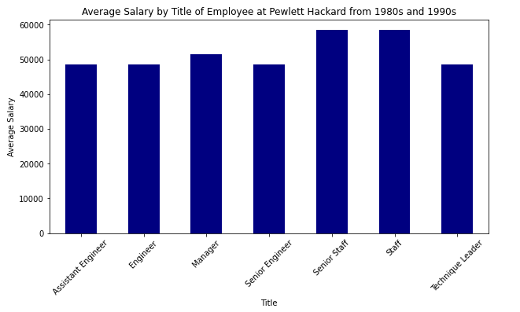

# Querying with SQL
A mini project using example datasets to demonstrate data engineering/data modeling and data analysis. 

## Data Engineering
I designed the table schemas prior to loading the data files into a newly created database. For all the 6 CSV files, I defined data columns, data types, primary keys and foreign keys. 

## Data Analysis
Once the database is complete, I answered some sample questions using various query syntax.

## Bonus - Introducing Python
Using pandas and sqlalchemy packages from Python to import SQL database in order to create the below visualizations from the data:

